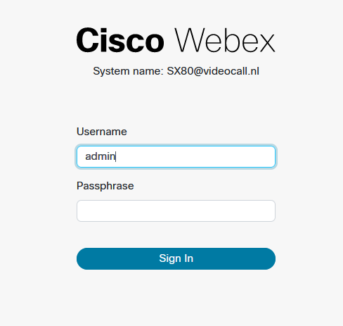
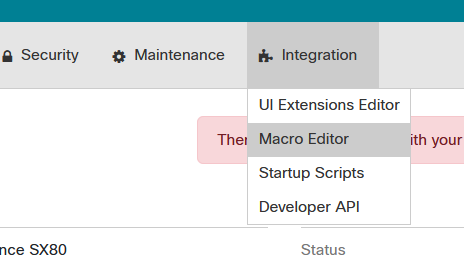

# Gebruik en installatie documentatie

- [Gebruik en installatie documentatie](#gebruik-en-installatie-documentatie)
  - [installeren](#installeren)
    - [instellingen aanpassen](#instellingen-aanpassen)
    - [macro installeren](#macro-installeren)
      - [1. Login op de codec](#1-login-op-de-codec)
      - [2. Macro installeren](#2-macro-installeren)
      - [3. Configureren van schermen](#3-configureren-van-schermen)
      - [4. Toevoegen van reset knop (optioneel)](#4-toevoegen-van-reset-knop-optioneel)
        - [overige instellingen](#overige-instellingen)
  - [gebruiken van macro](#gebruiken-van-macro)
    - [Voorbeeld van scherm weergeven](#voorbeeld-van-scherm-weergeven)
    - [schermen restten](#schermen-restten)

## installeren

### instellingen aanpassen

om de macro te installeren moet je eerst zorgen dat macro’s ingesteld zijn. Dat zijn de volgende:

- macros
  - AutoStart: ON
  - Mode: On
  - UnresponsiveTimeout: 5
  - XAPI Transport WebSocket

### macro installeren

zodra die goed ingesteld zijn kun je de applicatie installeren. Dat kun je gemakkelijk doen door de volgende stappen te volgen:

#### 1. Login op de codec

om in te loggen op de codec moet je eerst verbinding maken met de web interface van de codec. Dat kun je doen door in de browser naar het IP address van de codec te gaan. `bijv. 192.168.17.94`.

zodra je op de inlog pagina bent moet je inloggen. Het standaard wachtwoord voor het admin account bestaat niet. Dus als die niet aangepast is kun je inloggen met de gebruikersnaam admin en geen wachtwoord.

#### 2. Macro installeren

nu je ingelogd bent kun je de macro installeren om dat te doen moet je kun je naar het tabblad `Macro Editor` gaan onder het kopje `Integration`.

zodra je in de Macro editor bent kun je de macro uploaden dat kun je doen door op de knop `Import from file...` te drukken, zodra je dat gedaan hebt kan je het bestand waar de macro in staat uploaden. Dat is een `.js` bestand. Als je de sourcecode hebt gedownload van [https://github.com/School-Michel-Gerding/ExamenOpdracht](https://github.com/School-Michel-Gerding/ExamenOpdracht) heeft hij de naam `shareScreen.js`. Zodra je dat gedaan hebt moet je hem opslaan dat kan door te drukken op de toetsen ctrl+s, je kun t het ook doen met de opslaan knop bij de macro in de lijst van macros.

zodra je dat hebt gedaan kun je de macoro gebruiken.

#### 3. Configureren van schermen

zodra je de macro geinstaleerd hebt moet je er voor zorgen dat minimaal 1 scherm ingesteld is als 1ste scherm. Om dat te doen moet je weer gaan naar het hoofdscherm van de webinterface. Vanaf de macro editor kun je terug naar het hoofdscherm door op het cisco logo links bovenin het scherm te klikken.

zodra je op het hoofdscherm bent kun je de schermen aanpassen door te klikken op de link Configuration in het kopje setup.

zodra je in de configuratie scherm bent moet je naar het kopje video gaan. Dat kun je doen door het linkje viedo te klikken in de navigatie lijst aan de linker zijkant. Zodra je in de configuratie van de video bent moet je verifieren dat teniminste 1 output de instelling `MonitorRole` op `First` staat. Zodra dat klaar is kan je de module gaan gebruiken.

#### 4. Toevoegen van reset knop (optioneel)

ook heeft de module de mogelijkheid om een reset knop te gebruiken. Daarvoor moet je een knop toevoegen aan het touch 10 paneel. Om dat te doen kan moet je eerst naar de `UI Extension Editor` gaan om daar te komen moet je vanaf het hoofdscherm op de link `UI Extension Editor` klikken deze staat onder het kopje `integration

zodra je in de ui extension editor bent kun je een nieuwe extensie maken. Dat kun je doen door op de knop nieuw te drukken in de linker sidebar.

zodra je op die knop drukt dan krijg je een keuze om een bepaald type toe te voegen. Daarvan moet je de action button kiezen. Zodra je dat hebt gedaan krijg je aan de rechter kant ook nog een sidebar erbij.
Daarin moet je de volgende dingen aanpassen:

- Id: het id moet je aanpassen naar het volgende : `reset_all_display`'
- Name: Dit is het label van de knop. Deze moet je aanpassen naar de naam die je op het touchpaneel wilt laten zien, bijv: `Reset Schermen`
- button visibility: met deze optie kun je selecteren waar de knop zichtbaar is. Deze die moet staan op `Only out of call` of `Always` als je hem ook in gesprekken wilt laten zien moet je hem zetten op `Always` anders op `Only out of call`
- icon: dit is het icoon van de knop die je te zien krijgt op de cisco codec deze kun je aanpassen naar wat je wilt.
- Extension button color: de kleur van de knop: deze optie bepaald de kleur vna de achtergrond van het icoon op het touch paneel. Deze kun je ook zelf bepalen.

zodra je dit ingesteld hebt kun je op de upload knop drukken of de sneltoest `ctrl+e` zodra je dat hebt gedaan kun je zien dat hij op het touchpaneel komt te staan.

zodra je dit hebt gedaan heb je alle dingen van de macro ingesteld en ben je klaar om hem te gaan gebruiken.

##### overige instellingen

deze macro heeft ook nog een paar instellingen. Namelijk de volgende:

- fallbackLanguage: de standaard taal die gebruikt wordt als de taal die in het systeem is ingesteld niet beschikbaar in is in de macro. Deze optie kan de volgende waardes hebben `dutch`, `english` en de standaard waarde is `english`.
Om meerdere talen toe te voegen kan je dat doen in de text variable in de macros broncode
- useMonitorName: dit is een optie om de naam van de monitoren aan te passen. Als de waarde van deze macro `true` is dan neemt hij standaard de waarde die gekregen is van het verbonden beeldscherm. Anders maakt hij gebruik van de ingestelde naam in de variabele connectorNames. Deze optie kan de waardes`true`en `false` hebben.
- text: dit is een datastructuur voor de text die in de module aan de gebruiker getoont wordt. Om een taal toe te voegen kun je een bestaande vertaling kopieren en binnen de buitenste `{}` plakken, daarnaa kiun je de text tussen de `"` aanpassen. De eerste die je kunt aanpassen is de naam van de taal. Verder is het de text die getoont wordt
- connectorNames: dit is de naam van de connectoren als er geen naam van het beeldscherm getoond woordt of de optie useMonitorName de waarde false heeft.

om deze instellingen aan te passen moet je de code van de macro aanpassen. Dat zijn de lijnen code tussen lijnen 2 en 31. Om de module te gebruiken hoeven deze niet aangepast te worden.

## gebruiken van macro

om gebruik te kunnen maken van de macro hoef je niet veel anders te doen dan zonder de macro. De macro maakt namelijk gebruik van de ingebouwde systemen voor het delen van het beeldscherm. De macro heeft 2 verschillende functionaliteiten: input delen naar bepaalde output en alle outputs resetten.

### Voorbeeld van scherm weergeven

om een scherm te delen druk je eerst op de knop scherm delen op het touch paneel, zodra je dat gedaan hebt krijg je een lijst met alle inputs met een knop eronder om een voorbeeld te bekijken. Als je op de knop voorbeeld drukt krijg je een popup te zien namelijk, hierin kun je bepalen welk scherm je hem op wilt laten zien. De naam voor het scherm komt te staan. Daar is ook de knop om de preview te stoppen. Als je op eze knop drukt dan komt stopt hij alle voorbeelden van dit invoerapparaat.

deze functionaliteit werkt alleen wel anders als je in een gesprek zit of niet, namelij, als je niet in een gesprek zit kun je alle schermen het voorbeeld op vertonen. Dat kan niet in een gesprek, dat is omdat je anders niet de gespreksinformatie kunt zien. Daarnaast als je een gesprek start dan stop hij het voorbeeld op dat scherk

### schermen restten

als je met de installatie stap 4 hebt uitgevoerd heb je ook een knop om alle schermen te resetten. Deze knop is handig als er iets fout gaat met een macro en hij daardoor de macros herstart. Dan vergeet hij namelijk wat op welk scherm te zien is. Daarvoor is dezee knop. Als je op deze knop drukt dan stopt hij alle previews en geeft hij een bericht als alles succesvol gebeurt is.
